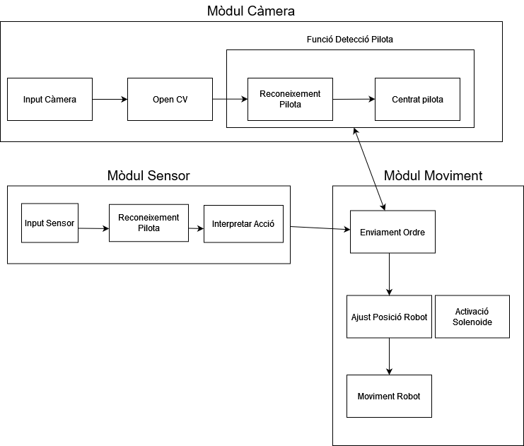
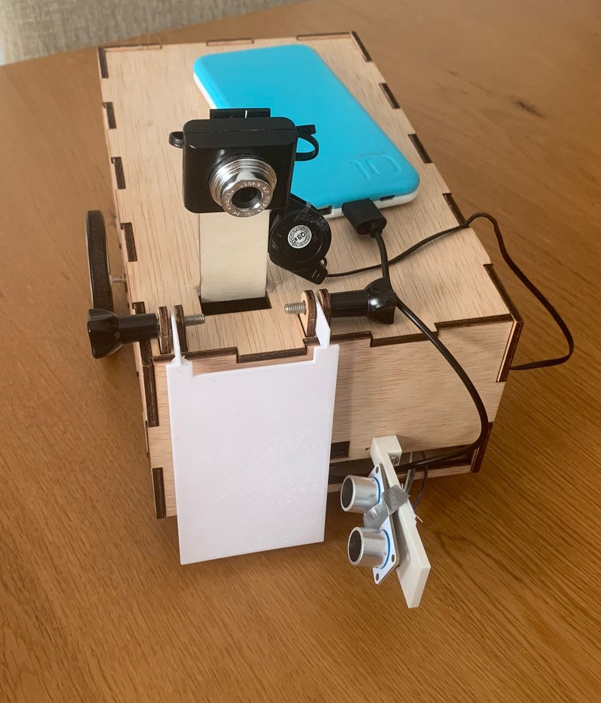

# MiniGolfer
MiniGolfer es un robot el cual es capaz de jugar a minigolf.

### [Contingut](#contingut)
### [Requeriments](#requeriments)
### [Components](#components)
### [Esquema HW](#esquema-hw)
### [Esquema SW](#esquema-sw)
### [Resultats Finals + Video](#resultats-finals--video)
### [Autors](#autors)

### Contingut

El robot està dissenyat per jugar al minigolf de manera autònoma. S’equipa amb dues rodes principals per al desplaçament i una roda addicional multidireccional per a una millor maniobrabilitat. El robot utilitza una càmera per localitzar i seguir la pilota de golf al camp de joc. Una vegada ha identificat la pilota, el robot s'aproxima a ella.
Per determinar la proximitat exacta a la pilota, el robot està equipat amb un sensor d'ultrasons. Quan el sensor detecta que la pilota està a l'abast, el robot s’atura. A continuació, activa un solenoide que mou una pala mecànica. Aquesta pala és responsable de colpejar la pilota, dirigir-la cap al forat.

### Requeriments
Les llibreries necessàries per aquest projecte son:
- RPi.GPIO
- OpenCV
- Numpy
- time

### Components
- Raspberry Pi 3 B+
- Cámara Raspberry
- 2 Motor Rodes
- Sensor de distancia por ultrasonidos
- Placa de prototipo
- Base para baterías (6xAA)
- Solenoide 5v
- Controlador de motores
- Bateria externa
- Relé

### Esquema HW

1.1. Connexió positiu del motor A  
1.2. Connexió positiu del motor B  
2.1. Connexió negatiu del motor A  
2.2. Connexió negatiu del motor B  
3. Alimentació 9v  
4. 5V de Raspberry  
5.1. Connexió de terra del driver connectat al GND de Raspberry  
5.2. Connexió de terra del driver connectat al GND de Raspberry  
6. Senyal anàloga para el motor A connectat al GPIO 12 de Raspberry  
7. Senyal anàloga para el motor B connectat al GPIO 13 de Raspberry  
8. 5V de Raspberry  
9.1. Senyal d'entrada del motor A connectat al GPIO 26 de Raspberry  
9.2. Senyal d'entrada del motor A connectat al GPIO 6 de Raspberry  
10.1. Senyal d'entrada del motor B connectat al GPIO 20 de Raspberry  
10.2. Senyal d'entrada del motor B connectat al GPIO 16 de Raspberry  
11. Alimentació del sensor d'ultrasònics connectat al 5V de Raspberry  
12. Connexió de terra del sensor d'ultrasons connectat al GND de Raspberry  
13. Senyal trigger del sensor d'ultrasons connectat al GPIO 14 de Raspberry  
14. Senyal eco del sensor d'ultrasons connectat al GPIO 15 de Raspberry  
15. Positiu de la bateria  
16. GND de la bateria  
17. GND del solenoide  
18. Alimentació del solenoide  
19. Connexió alimentació del solenoide via relé  
20. GND del solenoide connectat de Raspberry  
21. VCC del Relé connectat de Raspberry  
22. Connexió de senyal de relé al GPIO 4 de Raspberry  
23. 5V de Raspberry al protoboard  
24. Connexió GND de Raspberry al protoboard  

Conexió extra USB: Càmera

### Esquema SW

### Resultats Finals + Video

### Autors

- Arnau Altimira Rubio
- Bernat Brustenga Garriga
- Wenpeng Ji
- Joaquim Calavera Madaula
