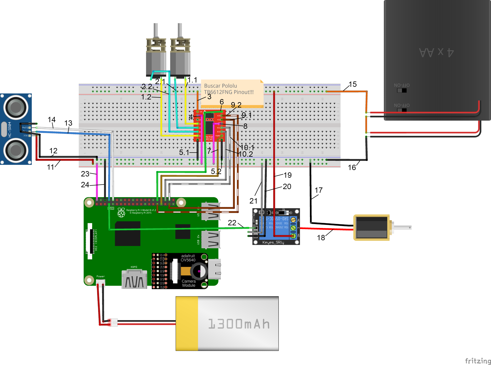

# MiniGolfer
MiniGolfer es un robot el cual es capaz de jugar a minigolf.

### [Contingut](#contingut)
### [Requeriments](#requeriments)
### [Components](#components)
### [Esquema HW](#esquema-hw)
### [Esquema SW](#esquema-sw)
### [Resultats Finals + Video](#resultats-finals--video)
### [Autors](#autors)

### Contingut

El robot està dissenyat per jugar al minigolf de manera autònoma. S’equipa amb dues rodes principals per al desplaçament i una roda addicional multidireccional per a una millor maniobrabilitat. El robot utilitza una càmera per localitzar i seguir la pilota de golf al camp de joc. Una vegada ha identificat la pilota, el robot s'aproxima a ella.
Per determinar la proximitat exacta a la pilota, el robot està equipat amb un sensor d'ultrasons. Quan el sensor detecta que la pilota està a l'abast, el robot s’atura. A continuació, activa un solenoide que mou una pala mecànica. Aquesta pala és responsable de colpejar la pilota, dirigir-la cap al forat.

### Requeriments
Les llibreries necessàries per aquest projecte son:
- RPi.GPIO
- OpenCV
- Numpy
- time

### Components
- Raspberry Pi 3 B+
- Cámara Raspberry
- 2 Motor Rodes
- Sensor de distancia por ultrasonidos
- Placa de prototipo
- Base para baterías (6xAA)
- Solenoide 5v
- Controlador de motores
- Bateria externa
- Relé

### Esquema HW

### Esquema SW

### Resultats Finals + Video
https://www.youtube.com/watch?v=eHLhcOQ6SlU
### Autors

- Arnau Altimira Rubio
- Bernat Brustenga Garriga
- Wenpeng Ji
- Joaquim Calavera Madaula
